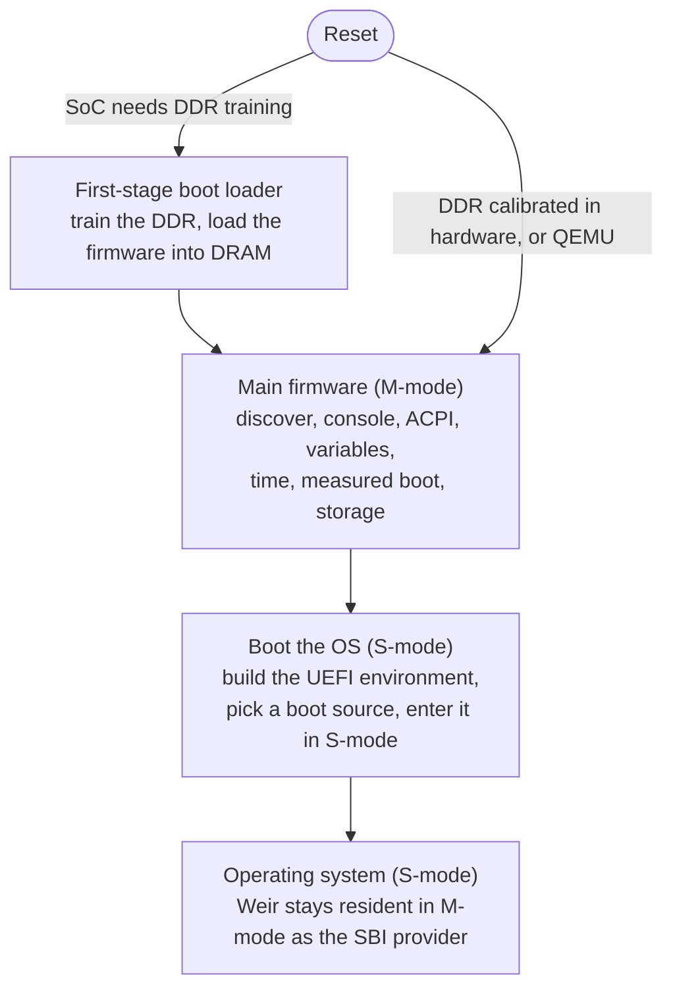

# Boot flow

This is the path from reset to a running operating system. Each stage has its own
doc for the detail. This one shows how they fit together.

## Stage 1: first-stage boot loader

When the SoC needs the CPU to train its DDR, the first-stage boot loader (FSBL)
runs first. It trains the DDR, copies the main firmware from flash into DRAM,
measures it, and jumps to it. A SoC that calibrates its DDR in hardware, and
QEMU, skip this stage and start the main firmware directly. See
[fsbl.md](fsbl.md).

## Stage 2: main firmware bring-up

The main firmware starts in M-mode at its reset vector, which clears `.bss` and
calls the bring-up. Only the boot hart runs it. The other harts wait for the SBI
to start them. The bring-up runs in this order:

1. **Discover the platform.** Read the device tree and find the peripheral
   addresses. This happens before the console, so the console uses the UART the
   tree reports.
2. **Console.** Bring up the UART and print the banner.
3. **ACPI.** Build the ACPI tables, or read the tables QEMU prepared. See
   [acpi.md](acpi.md).
4. **Variables.** Bring up the UEFI variable store, backed by flash when present.
5. **Time.** Bind an RTC, or start a software clock at the UNIX epoch.
6. **Measured boot.** Start the TPM and measure the firmware into PCR 0. If the
   FSBL already measured it, record that digest instead. See
   [measured-boot.md](measured-boot.md).
7. **Storage.** Discover the block devices: virtio-blk, an SD host, or an SD card
   on each SPI master.

## Stage 3: boot the operating system

The firmware builds the UEFI environment: the System Table, the Boot and Runtime
Services, and the configuration table with the ACPI, SMBIOS, and device-tree
pointers. See [uefi.md](uefi.md).

It then tries the boot sources in priority order:

1. The boot manager, which finds an ESP, mounts FAT, and honours the boot
   variables or the removable-media fallback.
2. An embedded PE application.
3. An embedded S-mode ELF payload.

The firmware loads the chosen image and enters it in S-mode, with the boot hart
ID and the device-tree pointer. If no source works, it halts.

## After hand-off

The operating system runs in S-mode. Weir stays resident in M-mode as the SBI
provider. When the OS makes an `ecall`, the trap handler routes it to the SBI,
which services it and returns to S-mode. See [sbi.md](sbi.md).
